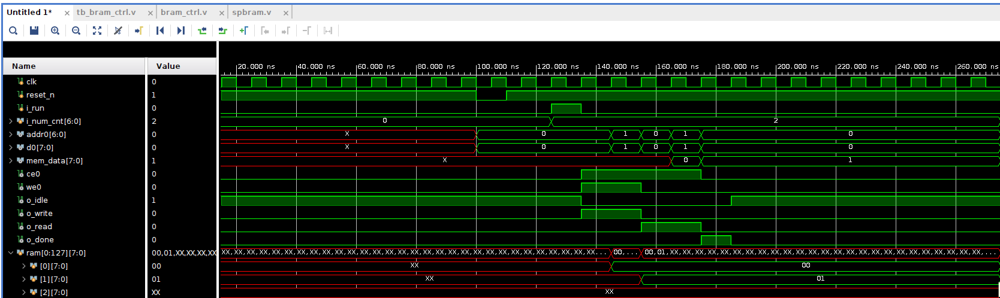

# BRAM Controller
## Introduction
FPGA 의 BRAM 을 Control 하는 모듈을 설계해 보았음.

### BRAM Structure

single-port RAM 을 control 하는 모듈임


single-port RAM의 in/output signals


### spbram module
- DWIDTH는 memory의 width bits 를 의미.
- AWIDTH는 Address를 나타낼 수 있는 비트 수를 의미함
> 원래 4095 까지 available하나 3840 주소까지 사용하기로 함. 따라서 MEM_SIZE 라는 parameter를 하나 더 생성.

- we0 == 1 이면 write mode, 0 이면 read mode 임
- d0은 read mode일때 받는 data, q0은 write mode 일때 내보내는 data 임

- reg [DWDITH-1:0] ram [0:MEM_SIZE-1] 는 c 언어로 치면 ram[MEM_SIZE-1][DWIDTH-1] 배열임

- we0이 enable 된 후 1 cycle 뒤에 data가 나옴 (이건 simulation을 통해 확인해볼 예정)

### Design Overview
1. **State**
- IDLE, WRITE, READ, DONE

2. **Operation**
- i_num_cnt 입력에 따라 addr0과 d0이 정해짐
- bram controlloer의 output we0, ce0, addr0, d0 은 spbram의 input이 되어 bram memory에 access 하여 read 하거나 write 한다.
- bram controller의 input MEM_SIZE는 bram 특정 메모리 주소의 data 값이다.


### Simulation

    - i_num_cnt = 2.
    - o_write가 1이 되고(we0이 1이되고) 1 cycle 뒤에 mem에 data가 저장된다.
    
    ```Verilog
    //spbram 모듈 내부에서의 FF 때문임
    always @(posedge clk) begin
	if(ce0) begin
	    if(we0) ram[addr0] <= d0;
	    else q0 <= ram[addr0]
	end
    end
    ```

    - o_read도 마찬가지이다.

