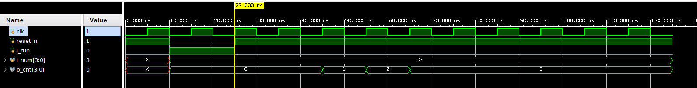
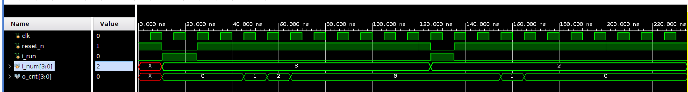

   # Counter

   ## Introduction
   15까지 셀 수 있는 counter 모듈을 설계해 보았음  
   (simulation이 용이하도록 15까지만 셀 수 있도록 함)

   ---

   ### Design Overview

   1. **State**
      - IDLE, RUN, DONE

   2. **Cycle**
      - 1 cycle마다 (조건이 맞으면) 상태천이가 이루어짐
      - 1 cycle마다 (조건이 맞으면) count를 함

   3. **Transition**
      1. **reset asserted**: (after 1 cycle) IDLE
      2. **i_run asserted**: (after 1 cycle) RUN
      3. **is_done asserted**: (after 1 cycle) DONE

   기본 상태는 IDLE

    ### Simulation
   
    3을 입력해 보았음

    
    3 입력 후 100ns 뒤에 2를 입력해보았음
    정상적으로 count 하는 것을 확인함

